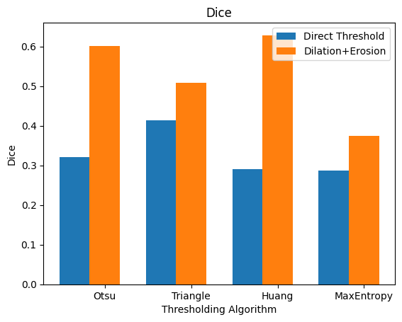
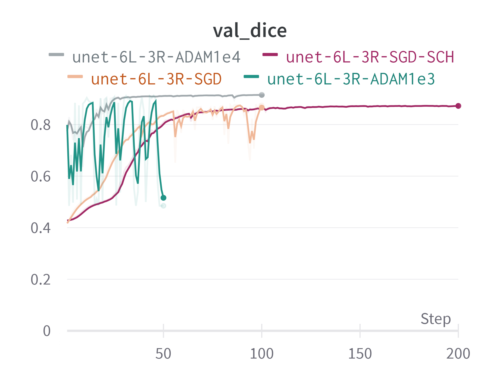
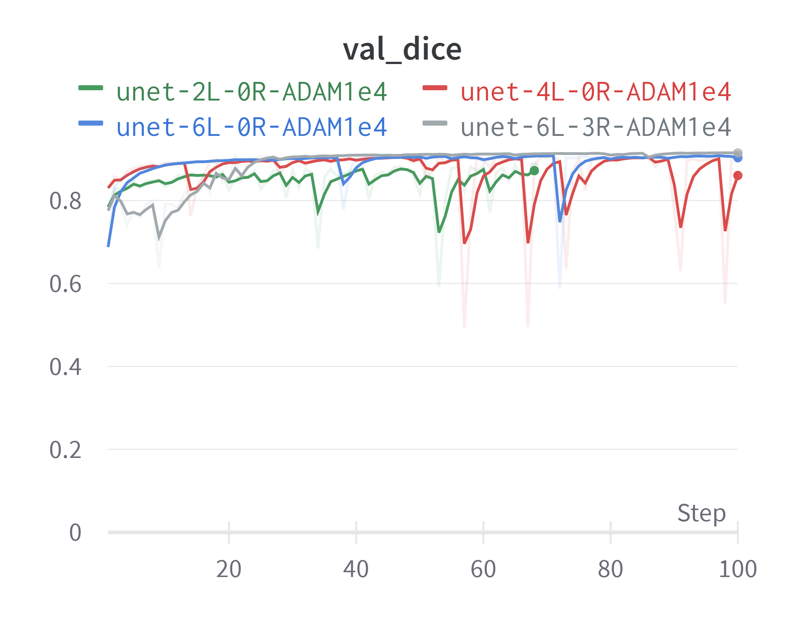
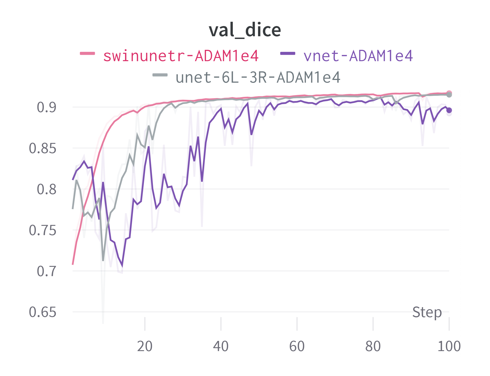
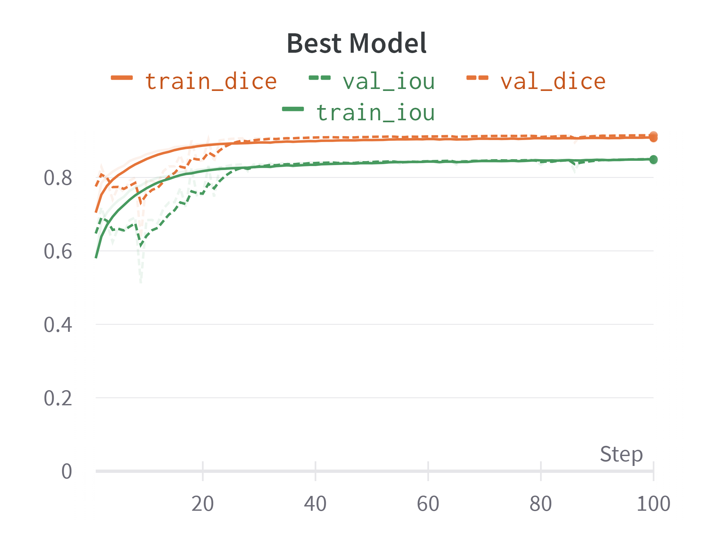

# LIVECell Semantic Segmentation
This repository contains course project deliverables of a project revolving around using MONAI and SimpleITK to perform semantic segmentation on the LIVECell dataset.

The overview of the project is as follows:
1. Preprocess LIVECell Dataset to make it suitable for semantic segmentation.
2. Establish a baseline using SimpleITK adaptive thresholding algorithms
3. Use Monai to train variations of UNET, VNET, and SwinUNETR
4. Evaluate performance using DICE and IoU metrics as well as explore performance on measuring Cell Confluence.

## Table of contents
1. [Environment_Setup](#Environment_Setup)
2. [Dataset](#Dataset)
3. [Preprocessing](#Preprocessing)
4. [Baseline]()
5. [Deep_Learning](#Deep_Learning)
	1. [Training]() 
	2. [Testing]()
	3. [Inference]()
6. [Results]()

## 1. Environment_Setup
The environment used is described in detail in the [environment.yml]() file. The project was run on a Windows11 machine with and an RTX3080 GPU with appropriate NVIDIA drivers installed.

Using conda you can create an environment as follows:

    conda env create -n livecellseg -f environment.yml

Then activate it as follows:

    conda activate livecellseg

## 2. Dataset
**Skip if you want to use already downloaded tiny subset**

The dataset used is [LIVECell](https://github.com/sartorius-research/LIVECell). It has many formats and subexperiments. What we require are 4 files to be downloaded:
1. [Images](http://livecell-dataset.s3.eu-central-1.amazonaws.com/LIVECell_dataset_2021/images.zip)
2. [Training Annotation Set](http://livecell-dataset.s3.eu-central-1.amazonaws.com/LIVECell_dataset_2021/annotations/LIVECell/livecell_coco_train.json)
3. [Validation Annotation Set](http://livecell-dataset.s3.eu-central-1.amazonaws.com/LIVECell_dataset_2021/annotations/LIVECell/livecell_coco_val.json)
4. [Test Annotation Set](http://livecell-dataset.s3.eu-central-1.amazonaws.com/LIVECell_dataset_2021/annotations/LIVECell/livecell_coco_test.json)

*Visit the original LIVECell repository for updated links if the links above do not work.*

The code assumes by default that the dataset is downloaded with the following structure.

    <repository>/dataset
    .../images
    .../livecell_coco_train.json
    .../livecell_coco_val.json
    .../livecell_coco_test.json

You might notice that the repository already contains the above structure, for convenience, 1% of LIVECell was randomly sampled using `sample_subset.py` and has been uploaded for testing the code. If you want to use the whole dataset please replace the contents of the dataset folder with the full versions that you have downloaded from the above links.

## 3. Preprocessing

### 3.1. Instance Segmentation Labels to Semantic Segmentation Labels
We must convert LIVECell instance segmantation labels to semantic segmentation masks for all sets run the following commands

    python instance2semantic.py

You should see `./dataset/livecell_train_val_masks` and `./dataset/livecell_test_masks` folders generated with black and white images inside with white representing cells and with black for the background.

### 3.2. (Optional) Fix duplicate images and mutual exclusiveness
To ensure more accurate results refer to my [GitHub issue](https://github.com/sartorius-research/LIVECell/issues/26) for a list of duplicate images as well as images common between training and validation. It is recommended that you remove those images before proceeding with training.

### 3.3. (Optional) Remove corrupt annotations
Once you have the semantic segmentation masks it is easy to skim through the directory and observe outlier masks (Masks only having one cell) and removing them and their corresponding image and annotation.

## 4. Baseline
For the baseline I tested 4 adaptive thresholding algorithms with and without binary morphology using simpleitk.

If you have done the previous steps you can simply run the notebook `baseline.ipynb` to obtain results for the baseline. It contains comments and sections to guide you.
If you have not changed the location of the dataset, the notebook should run from start to finish without errors.

## 5. Deep_Learning

For the deep learning models, I have tested different configurations of UNET, VNET, and SwinUNETR. The best trained model (SwinUNETR) is uploaded in `models/`. 

All steps to reproduce a trained model like the one uploaded is available in the notebook `deep_learning.ipynb`. It is set to run for 1 epoch by default just so that you are able to run it to completion on the subset quickly for testing.

The notebook also contains testing and inference code as well as dataset exploration and visualizations.

Again, if you have not changed the location of the dataset, the notebook should run from start to finish without errors.

## 6. Results

### 6.1 Baseline:

### 6.2 Optimizers and Learning rates Ablation:
SCH refers to using a cosine annealing learning rate scheduler.

### 6.3 Unet Layers Ablation:

### 6.4 Arch Comparison:

### 6.5 Best Unet Model:
Best UNET model had the following architecture

    # UNet 6L-3R (36.9 MB)
    model = UNet(
        spatial_dims=2,
        in_channels=1,
        out_channels=1,
        channels=(16, 32, 64, 128, 256, 512),
        strides=(2, 2, 2, 2, 2),
        num_res_units=3,
        norm=Norm.BATCH,
    )
    optimizer = Adam(model.parameters(), lr=1e-4)
    learning_rate_scheduler = None

### 6.6 Cell Confluence Results:

|     Architecture    |              |     Confluence RMSE    |             |
|:-------------------:|:------------:|:----------------------:|:-----------:|
|                     |     Train    |        Validation      |     Test    |
|      Unet-6L-3R     |      7.6%    |            7%          |      6%     |
|      Unet-6L-0R     |       …      |            …           |       …     |
|      Unet-4L-0R     |      7.9%    |           7.2%         |     6.2%    |
|      Unet-2L-0R     |      9.2%    |           8.2%         |     9.3%    |

## References
[1] Edlund, C., Jackson, T.R., Khalid, N. et al. LIVECell—A large-scale dataset for label-free live cell segmentation. Nat Methods 18, 1038–1045 (2021). https://doi.org/10.1038/s41592-021-01249-6
[2] https://arxiv.org/abs/2211.02701
